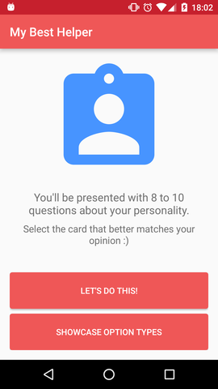

# vanhackathon-my-best-helper

This app was craeted as part of the Vanhackathon that happened during the weekend of May 20-22, 2016.

## A Profile quiz prototype for MyBestHelper

The idea is quite simple!

You start the app, click one of the possible buttons:

Then you start selecting the answers for the questions. There is a circle pager indicator at the bottom of the page.
I used https://robohash.org/ for the images... So you gotta use your imagination a litte bit for the options for every question :D

The main challenge requested that all answers had only 4 options, but I also created two other possible options types because based on the documentation I received earlier.

In the end, you press "Calculate Results" to get your profile! I wasn't creative at all here... It's just a button...

Finally, your (random) profile is shown and you can (fake) send your e-mail to the company to proccess that info :D 

I stubbed the Api using Sinatra, and the repository can be found here: https://github.com/daividssilverio/sampleapis
